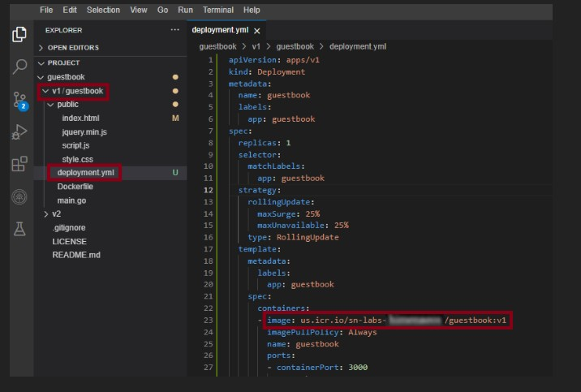
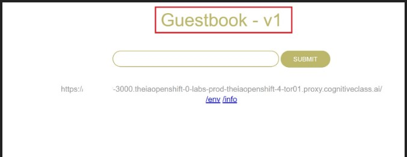

# 1. Peer Graded| Final Project- Build and Deploy a Guestbook App

## 1.1. This is from IBM course `Introduction to Containers w/Docker, Kubernetes & OpenShift`

### 1.1.1. Asignments for v1/guestbook:

#### 1.1.1.1. Build the guestbook app
1. Complete the Dockerfile with the necessary Docker commands to build and push your image. The path to this file is `guestbook/v1/guestbook/Dockerfile`

2. Export your namespace as an environment variable so that it can be used in subsequent commands.
3. Build the guestbook app using the Docker Build command.
4. Push the image to IBM Cloud Container Registry.
5. Verify that the image was pushed successfully.
6. Open the deployment.yml file in the v1/guestbook directory & view the code for the deployment of the application.
7. Apply the deployment using Kubernetes descriptive command from .yml file
8. Open a New Terminal and enter command to view your application.
9. Launch your application on port 3000.
10. Now you should be able to see your running application. Please copy the app URL which will be given.
11. Try out the guestbook by putting in a few entries. You should see them appear above the input box after you hit Submit.

#### 1.1.1.2. Solution 
1. 
        FROM golang:1.15 as builder
        RUN go get github.com/codegangsta/negroni
        RUN go get github.com/gorilla/mux github.com/xyproto/simpleredis
        COPY main.go .
        RUN go build main.go

        FROM ubuntu:18.04

        COPY --from=builder /go//main /app/guestbook
        COPY public/index.html /app/public/index.html
        COPY public/script.js /app/public/script.js
        COPY public/style.css /app/public/style.css
        COPY public/jquery.min.js /app/public/jquery.min.js

        WORKDIR /app
        CMD ["./guestbook"]
        EXPOSE 3000

2. 
       export MY_NAMESPACE=sn-labs-$USERNAME

3. 
        docker build . -t us.icr.io/$MY_NAMESPACE/guestbook:v1

4. 
        ibmcloud cr login
        ibmcloud cr region-set us-south
        docker push us.icr.io/$MY_NAMESPACE/guestbook:v1

5. 
       ibmcloud cr images

6. 
  

7. 
       kubectl apply -f deployment.yml

8. 
        kubectl port-forward deployment.apps/guestbook 3000:3000

9. 

10. em
    
#### 1.1.1.3. Autoscale the Guestbook application using Horizontal Pod Autoscaler
- Autoscale the Guestbook deployment using `kubectl autoscale deployment`
- Check the current status of the newly-made HorizontalPodAutoscaler
- Open another new terminal and enter command to generate load on the app to observe the autoscaling (Please ensure your port-forward command is running. In case you have stopped your application, please run the port-forward command to re-run the application at port 3000.)
- Run command to observe the replicas increase in accordance with the autoscaling.
- Run the above command again after 5-10 minutes and you will see an increase in the number of replicas which shows that your application has been autoscaled.
- Run command to observe the details of the horizontal pod autoscaler.
- 
